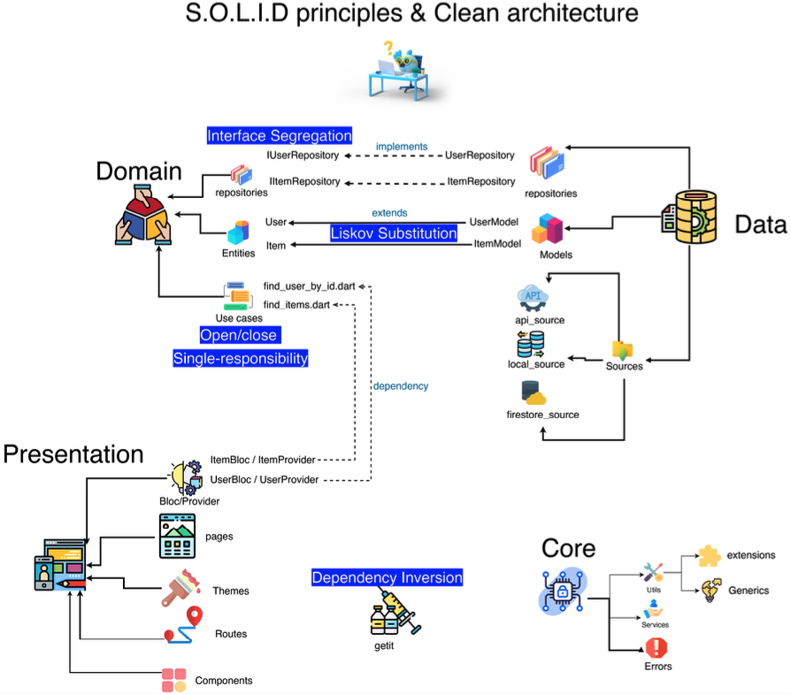

# Calorie Tracker

A simple flutter project demonstrating Clean Architecture using Riverpod, we use and recommend at Pixel Apps.

## Clean Architecture


The [Clean Architecture](https://blog.cleancoder.com/uncle-bob/2012/08/13/the-clean-architecture.html) is the system architecture guideline proposed by Robert C. Martin (Uncle Bob) derived from many architectural guidelines like Hexagonal Architecture, Onion Architecture, etc. over the years.

This is one of the guidelines adhered to by software engineers to build scalable, testable, and maintainable software.

### Principles of Clean Architecture

1. <b>Independent of Frameworks</b>
   The architecture does not depend on the existence of some library of feature laden software. This allows you to use such frameworks as tools, rather than having to cram your system into their limited constraints.
2. <b>Testable</b>
   The business rules can be tested without the UI, Database, Web Server, or any other external element.
3. <b>Independent of UI</b>
   The UI can change easily, without changing the rest of the system. A Web UI could be replaced with a console UI, for example, without changing the business rules.
4. <b>Independent of Database</b>
   You can swap out Oracle or SQL Server, for Mongo, BigTable, CouchDB, or something else. Your business rules are not bound to the database.
5. <b>Independent of any external agency</b>
   In fact your business rules simply don’t know anything at all about the outside world.

## Clean Architecture & Flutter

> Clean architecture is not about a particular state management technique.

The app is divided mainly into three layers: <b>Presentation</b>, <b>Domain</b> and <b>Data</b>.

Here is a high-level overview of Flutter Clean Architecture.



### Data

The data layer can have an entry point - a repository. The repository should only have responsibility for interacting with sources for load/save/send data to/from REST, XMPP, Database, Device, 3rd party SDK. Repository is where you decide if you return fresh or cached data, when to cache it and so on.

The repository should work with sources via [DTO models](https://en.wikipedia.org/wiki/Data_transfer_object). DTO models handle JSON Serialization while interacting with external data sources. The reason behind not opting for Entities (in Domain layer) across the app is that to separate these serialization-related operations from Domain layer. In case, we shift from JSON to XML in future, Domain Layer would still remain the same.

Data-layer directory structure:

```
data
|- data_sources
|   |- local
|   |   |- storage
|   |       |- local_storage_data_source_impl.dart
|   |- remote
|       |- database
|           |- remote_database_data_source_impl.dart
|- dto
|   |- app_user
|       |- app_user_dto.dart
|- repositories
    |- authentication
        |- auth_repo_impl.dart
```

### Domain

Domain should have only business logic and interact with the data layer (repository) and work with use cases.  
The Domain should convert/map the DTO objects from repository to entity if Domain returned any entity.

We define a contract of what the Repository must do - this goes into the domain layer. We then depend on the Repository "contract" defined in domain, knowing that the actual implementation of the Repository in the data layer will fullfill this contract.

> Use Cases are classes which encapsulate all the business logic of a particular use case of the app

Domain-layer directory structure:

```
domain
|- data_sources
|   |- local
|   |   |- storage
|   |       |- local_storage_data_source.dart
|   |- remote
|       |- database
|           |- remote_database_data_source.dart
|- entities
|   |- app_user
|       |- app_user.dart
|- providers
|   |- app_user
|       |- app_user_provider.dart
|- repositories
|   |- authentication
|       |- auth_repo.dart
|- use_cases
    |- app_user
        |- sign_in_using_custom_token_use_case.dart
```

### Presentation

The presentation layer should use the MVVM presentation pattern
Model → our business logic. it’s domain
View → our UI components (screens)
ViewModel → class which interacts between View and Model (The view model shouldn’t have any direct access to View)

The View should not have any business logic.

Presentation-layer directory structure:

```
presentation
|- constants
|   |- colors
|       |- app_colors.dart
|- screens
|   |- auth_page
|       |- states
|       |   |- auth_page_view_state.dart
|       |- auth_page_view_model.dart
|       |- auth_page.dart
|- shared_widgets
    |- buttons
        |- custom_rounded_button.dart
```

### Data-flow through layers

Data flows from a Data Source to a View in the following way:

> View <-> View Model <-> Provider <-> Usecase <-> Repository <-> Data Source

View Model and Provider both maintain states but are different in their responsibilities. A View Model maintains a state of all the interactive components on the screen such as Text Field, Buttons, Loading Indicator. While a provider maintains the state of the actual data. For example, `App User Provider` maintains the state of the App User while `Auth Page View Model` is responsible for showing loaders or carrying out form-operations.

### Exception Handling

It is not the best choice to let exceptions freely propagate, having to remember to catch them somewhere else in the code. Instead, we want to catch exceptions as early as possible (in the Repository) and then return Failure objects from the methods in question.

The [dartz](https://pub.dev/packages/dartz) package, brings functional programming (FP) to Dart.
`Either<L, R>` type can be used to represent any two types at the same time and it's just perfect for error handling, where `L` is the Failure and `R` is the data. This way, the Failures don't have their own special "error flow" like exceptions do. They will get handled as any other data without using try/catch.

Before we can proceed with writing the Use Cases, we have to define the Failures first, since they will be one part of Either return type. Failures will be used across multiple app features and layers, so let's create them in the core folder under a new error subfolder.

```dart
class Failure {
  final String message;

  Failure({this.message = "Unknown Error"});
}
```

To demonstrate what repository contract, repository implementation, data source contract and data source contract should like, we will take Weather App as an example.

**Repository contract:**

```dart
import 'package:dartz/dartz.dart';

import '../../../../core/error/failure.dart';
import '../entities/number_trivia.dart';

abstract class WeatherRepository {
  Future<Either<Failure, WeatherModel>> getWeatherNearMe();
}
```

**Remote Data Source contract:**

```dart
import 'package:dartz/dartz.dart';

import '../../../../core/error/failure.dart';
import '../../domain/entities/number_trivia.dart';

abstract class RemoteDataSource {
  Future<Either<Failure, WeatherModel>> getWeatherNearMe();
}
```

**Remote Data Source Implementation:**

```dart
import 'package:dartz/dartz.dart';

import '../../../../core/error/failure.dart';
import '../../domain/entities/number_trivia.dart';
import '../../domain/repositories/remote_data_source.dart';

class RemoteDataSourceImpl implements RemoteDataSource {
  Future<Either<Failure, WeatherModel>> getWeatherNearMe() async {
    try {
      // DO SOMETHING
      // SUCCESS
      return Right(WeatherModel());
      // FAILURE
      return Left(Failure(message = <FAILURE_MESSAGE>));
    }
    catch(e) (
      return Left(Failure());
    }
  }
}
```

**Repository Implementation:**

```dart
import 'package:dartz/dartz.dart';

import '../../../../core/error/failure.dart';
import '../../domain/entities/number_trivia.dart';

class WeatherRepositoryImpl {
  final RemoteDataSource _remoteDataSource; // Initialised using Dependency Injection

  Future<Either<Failure, WeatherModel>> getWeatherNearMe() async {
    final either = await _remoteDataSource.getWeatherNearMe();
    return either.fold(
            (l) => l,   // ON FAILURE
            (r) => r,   // ON SUCCESS
            );
  }
```

## References

- [The Clean Architecture by Robert C. Martin (Uncle Bob)](https://blog.cleancoder.com/uncle-bob/2012/08/13/the-clean-architecture.html)
- [Clean Architecure Layers and Folder Structure by Reso Coder](https://resocoder.com/2019/08/27/flutter-tdd-clean-architecture-course-1-explanation-project-structure/)
